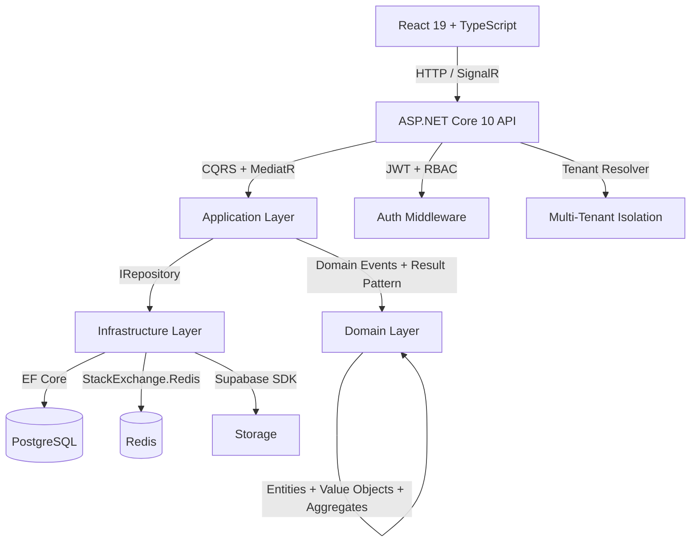

# Baby Turismo

[Versão em português](README.md) | [English version](#baby-turismo)

Operational management system built for Baby Turismo, a passenger road transport company. Features a web admin panel for fleet, trips, drivers, finance, and inventory control, plus a mobile-first driver portal with checklists, fuel logs, and real-time issue reporting.


## Stack

| Layer | Technologies |
|-------|-------------|
| **Backend** | ASP.NET Core 10, EF Core, CQRS + MediatR, FluentValidation, Serilog, SignalR |
| **Frontend** | React 19, TypeScript 6, Vite 8, TanStack Query, Zustand, Tailwind CSS, shadcn/ui, Recharts, ECharts |
| **Database** | PostgreSQL 16 (Supabase), Redis 7.2 |
| **Infra** | Docker Compose, Nginx (reverse proxy + SSL), GitHub Actions |
| **Deploy** | Frontend → Vercel · API → Render · DB → Supabase |

## Architecture

Clean Architecture + Domain-Driven Design with 5-layer separation:



### Design Patterns

- **CQRS** — Commands and Queries separated via MediatR
- **Result Pattern** — Typed errors without exceptions for business flows
- **Value Objects** — `Cpf`, `Email`, `Plate` with built-in validation
- **Domain Events** — `AggregateRoot` with events propagated via MediatR
- **Unit of Work** — `UnitOfWork` + `Repository<T>` with interceptors (auditing, RLS)
- **Multi-Tenant** — Middleware resolves tenant per request + RLS in PostgreSQL
- **Real-time** — SignalR `FleetHub` with tenant-based groups
- **Background Jobs** — Document expiry alerts and fuel reminders

## Structure

```
BabyC/
├── backend/
│   ├── src/
│   │   ├── BabyTurismo.Api/            # Controllers, Middleware, SignalR
│   │   ├── BabyTurismo.Application/    # CQRS Handlers, Validators, Services
│   │   ├── BabyTurismo.Domain/         # Entities, Value Objects, Events
│   │   ├── BabyTurismo.Infrastructure/ # EF Core, Redis, Background Jobs
│   │   └── BabyTurismo.Shared/        # Result, PagedResult, DTOs
│   └── tests/
│       └── BabyTurismo.Tests/         # xUnit (Auth, Fleet, Operations)
├── frontend/
│   └── src/
│       ├── components/                 # Layout + shared UI
│       ├── pages/                      # Dashboard, Fleet, Trips, Drivers, Finance, Inventory, Maintenance
│       ├── services/                   # Axios + TanStack Query client
│       ├── store/                      # Zustand (Auth, Theme)
│       ├── hooks/                      # SignalR hook
│       └── types/                      # TypeScript types
├── nginx/                              # Reverse proxy + SSL
└── docker-compose.yml                  # API + Frontend + PostgreSQL + Redis + Nginx
```

## Modules

| Module | Description |
|--------|-------------|
| Auth | JWT with Refresh Tokens, RBAC (Admin, Manager, Driver) |
| Dashboard | Operational and financial KPIs, Recharts/ECharts graphs, real-time alerts |
| Drivers | Driver registration, license (CNH), availability, history |
| Vehicles | Fleet, documents (permits/insurance/licensing), expiry alerts |
| Trips | Trip scheduling, operational checklists, status tracking |
| Driver Portal | Mobile-first portal for drivers: trips, checklists, fuel logs, issue reports |
| Finance | Revenue, expenses, cash flow, cost centers, monthly closing |
| Inventory | Products, movements (in/out/transfer), stock control |
| Maintenance | Preventive and corrective maintenance with vehicle history |
| FuelLogs | Fuel records, average consumption, configurable reminders |
| Notifications | In-app notifications via SignalR (stock alerts, documents, issues) |

## Getting Started

### With Docker (recommended)

```bash
git clone https://github.com/DerickDutraDev/Baby-Turismo.git
cd Baby-Turismo
cp .env.example .env
```

**Important**: Edit `.env` with your credentials **before** starting the containers:

```env
# Admin credentials (used on first run to create the initial admin user)
SEED_SYSTEM_ADMIN_EMAIL=youremail@gmail.com
SEED_SYSTEM_ADMIN_PASSWORD=YourStrongPassword123!
SEED_TENANT_ADMIN_EMAIL=youremail@gmail.com
SEED_TENANT_ADMIN_PASSWORD=YourStrongPassword123!

# Service passwords (generate strong passwords)
POSTGRES_PASSWORD=your_postgres_password
REDIS_PASSWORD=your_redis_password
JWT_SECRET=generate_a_random_secret_with_at_least_64_characters
SUPABASE_SERVICE_KEY=your_supabase_service_key
```

After configuring, start the containers:

```bash
docker compose up -d
```

| Service | URL |
|---------|-----|
| Frontend | `http://localhost` |
| API | `http://localhost:5000` |
| Swagger | `http://localhost:5000/swagger` |
| PostgreSQL | `localhost:5432` |
| Redis | `localhost:6379` |

### Development

```bash
# Backend
cd backend && dotnet restore && dotnet run

# Frontend
cd frontend && npm install && npm run dev
```

## Tests

```bash
cd backend && dotnet test
```

Coverage: authentication (login/logout/refresh), drivers (CRUD/availability), vehicles (CRUD/assignment), trips (full lifecycle).

## Deployment

- **Frontend**: Vercel (auto-build via `vercel.json`)
- **API**: Render (Docker image via `render.yaml`)
- **Database**: Supabase (PostgreSQL + Storage)
- **CI**: Health checks + Docker multi-stage builds

## Author

**Derick Dutra** — [GitHub](https://github.com/DerickDutraDev) · [LinkedIn](https://www.linkedin.com/in/derick-dutra)
