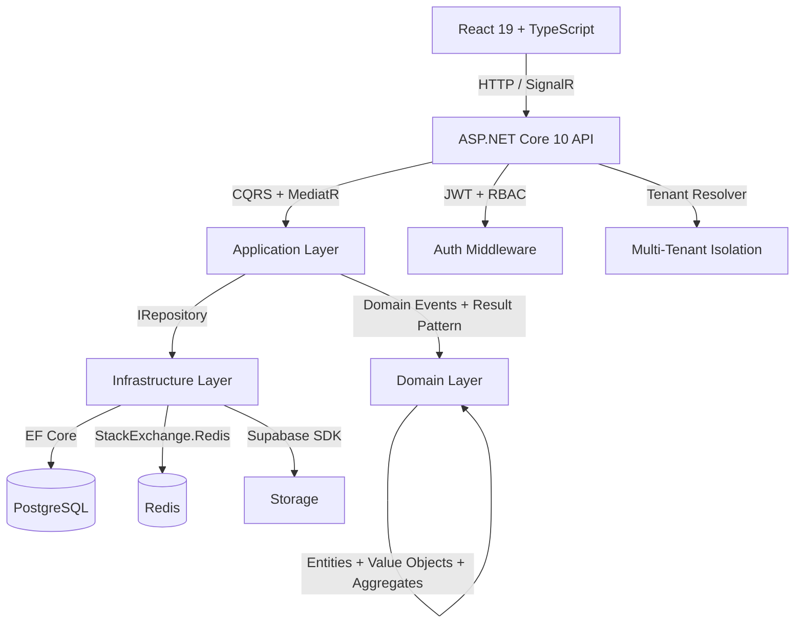

# Baby Turismo

Sistema de gestão operacional desenvolvido para a Baby Turismo, empresa de transporte rodoviário de passageiros. Possui painel administrativo web para controle de frota, viagens, motoristas, financeiro e estoque, além de portal mobile para motoristas com checklists, abastecimentos e reportes em tempo real.


## Stack

| Camada | Tecnologias |
|--------|------------|
| **Backend** | ASP.NET Core 10, EF Core, CQRS + MediatR, FluentValidation, Serilog, SignalR |
| **Frontend** | React 19, TypeScript 6, Vite 8, TanStack Query, Zustand, Tailwind CSS, shadcn/ui, Recharts, ECharts |
| **Database** | PostgreSQL 16 (Supabase), Redis 7.2 |
| **Infra** | Docker Compose, Nginx (reverse proxy + SSL), GitHub Actions |
| **Deploy** | Frontend → Vercel · API → Render · DB → Supabase |

## Arquitetura

Clean Architecture + Domain-Driven Design com separação em 5 camadas:



### Padrões aplicados

- **CQRS** — Commands e Queries separados via MediatR
- **Result Pattern** — Erros tipados sem exceptions para fluxo de negócio
- **Value Objects** — `Cpf`, `Email`, `Plate` com validação embutida
- **Domain Events** — `AggregateRoot` com eventos propagados via MediatR
- **Unit of Work** — `UnitOfWork` + `Repository<T>` com interceptores (auditoria, RLS)
- **Multi-Tenant** — Middleware resolve tenant por request + RLS no PostgreSQL
- **Real-time** — SignalR `FleetHub` com grupos por tenant
- **Background Jobs** — Alertas de documentos vencidos e lembretes de abastecimento

## Estrutura

```
BabyC/
├── backend/
│   ├── src/
│   │   ├── BabyTurismo.Api/            # Controllers, Middleware, SignalR
│   │   ├── BabyTurismo.Application/    # CQRS Handlers, Validators, Services
│   │   ├── BabyTurismo.Domain/         # Entities, Value Objects, Events
│   │   ├── BabyTurismo.Infrastructure/ # EF Core, Redis, Background Jobs
│   │   └── BabyTurismo.Shared/        # Result, PagedResult, DTOs
│   └── tests/
│       └── BabyTurismo.Tests/         # xUnit (Auth, Fleet, Operations)
├── frontend/
│   └── src/
│       ├── components/                 # Layout + shared UI
│       ├── pages/                      # Dashboard, Fleet, Trips, Drivers, Finance, Inventory, Maintenance
│       ├── services/                   # Axios + TanStack Query client
│       ├── store/                      # Zustand (Auth, Theme)
│       ├── hooks/                      # SignalR hook
│       └── types/                      # TypeScript types
├── nginx/                              # Reverse proxy + SSL
└── docker-compose.yml                  # API + Frontend + PostgreSQL + Redis + Nginx
```

## Módulos

| Módulo | Descrição |
|--------|-----------|
| Auth | JWT com Refresh Tokens, RBAC (Admin, Gestor, Motorista) |
| Dashboard | KPIs operacionais e financeiros, gráficos Recharts/ECharts, alertas em tempo real |
| Drivers | Cadastro de motoristas, CNH, disponibilidade, histórico |
| Vehicles | Frota, documentação (ANTT/ARTESP/Seguro/Licenciamento), alertas de vencimento |
| Trips | Agenda de viagens, checklists operacionais, controle de status |
| Driver Portal | Portal mobile-first para motoristas: viagens, checklists, abastecimentos, reportes |
| Finance | Receitas, despesas, fluxo de caixa, centro de custos, fechamento mensal |
| Inventory | Produtos, movimentações (entrada/saída/transferência), controle de estoque |
| Maintenance | Manutenções preventivas e corretivas com histórico por veículo |
| FuelLogs | Registro de abastecimentos, consumo médio, lembretes configuráveis |
| Notifications | Notificações in-app com SignalR (alertas de estoque, documentos, problemas) |

## Como Rodar

### Com Docker (recomendado)

```bash
git clone https://github.com/DerickDutraDev/Baby-Turismo.git
cd Baby-Turismo
cp .env.example .env
```

**Importante**: Edite o `.env` com suas credenciais **antes** de subir os containers:

```env
# Credenciais do admin (usadas na primeira execução para criar o usuário inicial)
SEED_SYSTEM_ADMIN_EMAIL=seuemail@gmail.com
SEED_SYSTEM_ADMIN_PASSWORD=SuaSenhaForte123!
SEED_TENANT_ADMIN_EMAIL=seuemail@gmail.com
SEED_TENANT_ADMIN_PASSWORD=SuaSenhaForte123!

# Senhas dos serviços (gere senhas fortes)
POSTGRES_PASSWORD=sua_senha_postgres
REDIS_PASSWORD=sua_senha_redis
JWT_SECRET=gere_um_secret_de_no_minimo_64_caracteres_aleatorios
SUPABASE_SERVICE_KEY=sua_service_key_supabase
```

Após configurar, suba os containers:

```bash
docker compose up -d
```

| Serviço | URL |
|---------|-----|
| Frontend | `http://localhost` |
| API | `http://localhost:5000` |
| Swagger | `http://localhost:5000/swagger` |
| PostgreSQL | `localhost:5432` |
| Redis | `localhost:6379` |

### Desenvolvimento

```bash
# Backend
cd backend && dotnet restore && dotnet run

# Frontend
cd frontend && npm install && npm run dev
```

## Testes

```bash
cd backend && dotnet test
```

Cobertura: autenticação (login/logout/refresh), motoristas (CRUD/disponibilidade), veículos (CRUD/atribuição), viagens (ciclo completo).

## Deploy

- **Frontend**: Vercel (build automático via `vercel.json`)
- **API**: Render (Docker image via `render.yaml`)
- **Database**: Supabase (PostgreSQL + Storage)
- **CI**: Health checks + Docker multi-stage builds

## Autor

**Derick Dutra** — [GitHub](https://github.com/DerickDutraDev)
